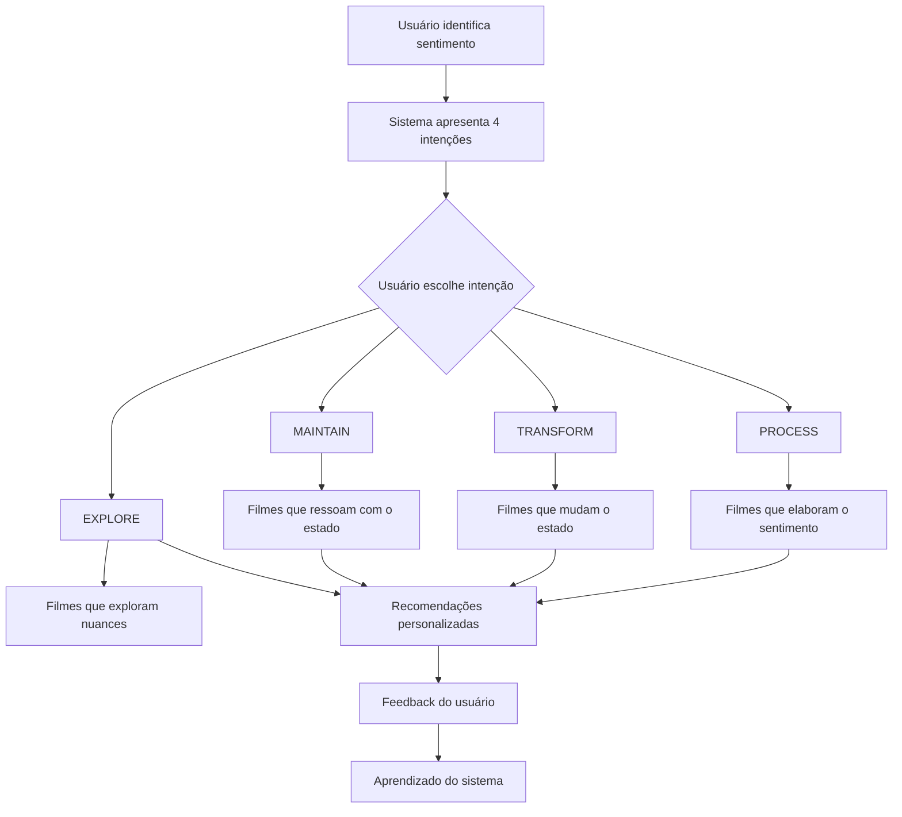

# 🎭 Guia de Implementação: Sistema de Intenção Emocional

## 📋 Visão Geral

Este documento detalha como implementar o sistema de **Intenção Emocional** no projeto de recomendação de filmes. O sistema resolve a ambiguidade emocional permitindo que usuários no mesmo estado emocional recebam recomendações completamente diferentes baseadas na sua **intenção**.

## 🎯 Problema Resolvido

**Situação Anterior:**
- Usuário triste → Sempre recebe filmes dramáticos
- Sem consideração da intenção do usuário
- Recomendações genéricas e previsíveis

**Situação Nova:**
- Usuário triste + Intenção "TRANSFORM" → Recebe comédias/animações
- Usuário triste + Intenção "PROCESS" → Recebe dramas reflexivos
- Usuário triste + Intenção "MAINTAIN" → Recebe dramas indie/arte
- Usuário triste + Intenção "EXPLORE" → Recebe filmes de época/complexos

## 🏗️ Arquitetura do Sistema

### 1. **Novos Modelos de Dados**

```typescript
// Enum para tipos de intenção
enum IntentionType {
  PROCESS    // Processar/elaborar o sentimento atual
  TRANSFORM  // Mudar/transformar o estado emocional  
  MAINTAIN   // Manter o estado atual
  EXPLORE    // Explorar nuances do sentimento
}

// Configurações de intenção por sentimento
model EmotionalIntention {
  id                    Int
  mainSentimentId       Int
  intentionType         IntentionType
  description           String
  preferredGenres       String[]
  avoidGenres           String[]
  emotionalTone         String // "similar", "contrasting", "progressive"
  subSentimentWeights   Json   // Pesos dos subsentimentos
}

// Sessões de recomendação do usuário
model RecommendationSession {
  id                    String
  userId                String?
  mainSentimentId       Int
  emotionalIntentionId  Int?
  sessionData           Json
  startedAt             DateTime
  completedAt           DateTime?
  isActive              Boolean
}

// Sugestões personalizadas baseadas em intenção
model EmotionalSuggestion {
  id                      String
  recommendationSessionId String
  emotionalIntentionId    Int
  movieId                 String
  personalizedReason      String
  relevanceScore          Decimal
  intentionAlignment      Decimal
  wasViewed               Boolean
  wasAccepted             Boolean
  userFeedback            String?
}
```

### 2. **Fluxo de Funcionamento**



## 🚀 Passos de Implementação

### **Passo 1: Migração do Banco de Dados**

```bash
# 1. Aplicar o novo schema
cp prisma/schema_extended.prisma prisma/schema.prisma
npx prisma db push

# 2. Gerar cliente Prisma atualizado
npx prisma generate

# 3. Popular configurações de intenção
npx ts-node src/scripts/populateEmotionalIntentions.ts
```

### **Passo 2: Integração das Rotas**

```typescript
// src/routes/index.ts
import emotionalRecommendationRoutes from './emotionalRecommendation.routes';

app.use('/api', emotionalRecommendationRoutes);
```

### **Passo 3: Frontend - Captura de Intenção**

```typescript
// Componente React para seleção de intenção
interface EmotionalIntentionStepProps {
  sentimentId: number;
  sentimentName: string;
  onIntentionSelected: (intentionType: string) => void;
}

const EmotionalIntentionStep: React.FC<EmotionalIntentionStepProps> = ({
  sentimentId,
  sentimentName,
  onIntentionSelected
}) => {
  const [intentions, setIntentions] = useState([]);

  useEffect(() => {
    // Buscar intenções disponíveis
    fetch(`/api/emotional-intentions/${sentimentId}`)
      .then(res => res.json())
      .then(data => setIntentions(data.intentions));
  }, [sentimentId]);

  return (
    <div className="intention-selection">
      <h2>Como você gostaria de lidar com esse sentimento?</h2>
      <p>Você está se sentindo: <strong>{sentimentName}</strong></p>
      
      {intentions.map(intention => (
        <button
          key={intention.type}
          onClick={() => onIntentionSelected(intention.type)}
          className="intention-option"
        >
          <h3>{getIntentionTitle(intention.type)}</h3>
          <p>{intention.description}</p>
        </button>
      ))}
    </div>
  );
};
```

### **Passo 4: Frontend - Consumo da API**

```typescript
// Serviço para recomendações emocionais
class EmotionalRecommendationService {
  
  async startEmotionalRecommendation(
    mainSentimentId: number,
    intentionType: string,
    userId?: string
  ) {
    const response = await fetch('/api/emotional-recommendations', {
      method: 'POST',
      headers: { 'Content-Type': 'application/json' },
      body: JSON.stringify({
        mainSentimentId,
        intentionType,
        userId
      })
    });
    
    return response.json();
  }

  async recordFeedback(
    sessionId: string,
    movieId: string,
    wasViewed: boolean,
    wasAccepted: boolean,
    feedback?: string
  ) {
    await fetch(`/api/emotional-recommendations/${sessionId}/feedback`, {
      method: 'POST',
      headers: { 'Content-Type': 'application/json' },
      body: JSON.stringify({
        movieId,
        wasViewed,
        wasAccepted,
        feedback
      })
    });
  }
}
```

## 🎨 Interface do Usuário

### **Tela 1: Seleção de Intenção**

```
┌─────────────────────────────────────────────┐
│ Como você gostaria de lidar com esse        │
│ sentimento?                                 │
│                                             │
│ Você está se sentindo: Triste               │
│                                             │
│ ┌─────────────────────────────────────────┐ │
│ │ 🔄 PROCESSAR                            │ │
│ │ Quero um filme que me ajude a           │ │
│ │ processar e elaborar essa tristeza      │ │
│ └─────────────────────────────────────────┘ │
│                                             │
│ ┌─────────────────────────────────────────┐ │
│ │ ✨ TRANSFORMAR                          │ │
│ │ Quero um filme que me ajude a           │ │
│ │ sair dessa tristeza                     │ │
│ └─────────────────────────────────────────┘ │
│                                             │
│ ┌─────────────────────────────────────────┐ │
│ │ 🎭 MANTER                               │ │
│ │ Estou bem com essa melancolia,          │ │
│ │ quero algo que ressoe com ela           │ │
│ └─────────────────────────────────────────┘ │
│                                             │
│ ┌─────────────────────────────────────────┐ │
│ │ 🔍 EXPLORAR                             │ │
│ │ Quero explorar diferentes aspectos      │ │
│ │ da tristeza e melancolia                │ │
│ └─────────────────────────────────────────┘ │
└─────────────────────────────────────────────┘
```

### **Tela 2: Recomendações Personalizadas**

```
┌─────────────────────────────────────────────┐
│ Recomendações para você                     │
│ Sentimento: Triste | Intenção: Transformar  │
│                                             │
│ ┌─────────────────────────────────────────┐ │
│ │ 🎬 Divertida Mente (2015)               │ │
│ │ ⭐ 8.2 | 95min | Animação, Família     │ │
│ │                                         │ │
│ │ "Este filme pode ajudar a transformar   │ │
│ │ seu estado emocional atual através de   │ │
│ │ uma jornada colorida sobre emoções."    │ │
│ │                                         │ │
│ │ Relevância: 92% | Alinhamento: 89%      │ │
│ │ [👍] [👎] [▶️ Assistir]                 │ │
│ └─────────────────────────────────────────┘ │
│                                             │
│ ┌─────────────────────────────────────────┐ │
│ │ 🎬 Paddington (2014)                    │ │
│ │ ⭐ 8.1 | 95min | Comédia, Família      │ │
│ │                                         │ │
│ │ "Uma narrativa que inspira mudança e    │ │
│ │ renovação emocional através do humor    │ │
│ │ gentil e otimismo contagiante."         │ │
│ │                                         │ │
│ │ Relevância: 88% | Alinhamento: 85%      │ │
│ │ [👍] [👎] [▶️ Assistir]                 │ │
│ └─────────────────────────────────────────┘ │
└─────────────────────────────────────────────┘
```

## 📊 Métricas e Analytics

### **Métricas Principais**
- **Taxa de Conclusão**: % de sessões completadas
- **Taxa de Visualização**: % de recomendações visualizadas
- **Taxa de Aceitação**: % de recomendações aceitas
- **Intenções Mais Populares**: Ranking por uso
- **Sentimentos Mais Ativos**: Ranking por sessões

### **Dashboard de Analytics**
```typescript
// Endpoint: GET /api/emotional-recommendations/analytics
{
  "overview": {
    "totalSessions": 1250,
    "completedSessions": 980,
    "completionRate": 78.4,
    "totalSuggestions": 8750,
    "viewedSuggestions": 6200,
    "acceptedSuggestions": 3100,
    "viewRate": 70.9,
    "acceptanceRate": 50.0
  },
  "popularIntentions": [
    { "sentiment": "Triste", "intentionType": "TRANSFORM", "sessionCount": 425 },
    { "sentiment": "Ansioso", "intentionType": "PROCESS", "sessionCount": 380 },
    { "sentiment": "Feliz", "intentionType": "MAINTAIN", "sessionCount": 310 }
  ],
  "popularSentiments": [
    { "sentiment": "Triste / Melancólico(a)", "sessionCount": 450 },
    { "sentiment": "Ansioso(a) / Nervoso(a)", "sessionCount": 380 },
    { "sentiment": "Feliz / Alegre", "sessionCount": 310 }
  ]
}
```

## 🔧 Configuração e Customização

### **Adicionando Novos Sentimentos**

```typescript
// 1. Adicionar no populateEmotionalIntentions.ts
{
  sentiment: "Nostálgico(a)",
  intentions: [
    {
      type: "PROCESS",
      description: "Quero mergulhar nessa nostalgia e revivê-la",
      preferredGenres: ["drama de época", "biografia", "romance clássico"],
      avoidGenres: ["sci-fi", "ação moderna"],
      emotionalTone: "similar",
      subSentimentWeights: {
        "Nostalgia": 2.0,
        "Melancolia Reflexiva": 1.8,
        "Emotivo(a) (Triste)": 1.6
      }
    }
    // ... outras intenções
  ]
}

// 2. Executar script de população
npx ts-node src/scripts/populateEmotionalIntentions.ts
```

### **Ajustando Algoritmos de Recomendação**

```typescript
// EmotionalRecommendationService.ts
private calculateRelevanceScore(movie: any, subSentimentWeights: Record<string, number>): number {
  // Customizar lógica de pontuação
  // Considerar fatores como:
  // - Correspondência de subsentimentos
  // - Qualidade do filme (vote_average)
  // - Popularidade (vote_count)
  // - Ano de lançamento
  // - Duração do filme
}
```

## 🧪 Testes e Validação

### **Scripts de Teste**

```bash
# Testar configurações de intenção
npx ts-node src/scripts/testEmotionalIntention.ts

# Testar recomendações para cenários específicos
npx ts-node src/scripts/testEmotionalRecommendations.ts "Triste" "TRANSFORM"
npx ts-node src/scripts/testEmotionalRecommendations.ts "Feliz" "MAINTAIN"
```

### **Casos de Teste Importantes**

1. **Usuário Triste + TRANSFORM**: Deve receber comédias/animações
2. **Usuário Feliz + PROCESS**: Deve receber dramas inspiradores
3. **Usuário Ansioso + TRANSFORM**: Deve receber filmes calmos
4. **Usuário Indiferente + EXPLORE**: Deve receber variedade de gêneros

## 🚀 Deployment e Monitoramento

### **Variáveis de Ambiente**
```env
# Adicionar ao .env
EMOTIONAL_RECOMMENDATIONS_ENABLED=true
MAX_RECOMMENDATIONS_PER_SESSION=10
FEEDBACK_COLLECTION_ENABLED=true
```

### **Monitoramento**
- Logs de sessões iniciadas/completadas
- Métricas de performance das recomendações
- Feedback dos usuários
- Erros de configuração de intenção

## 📈 Roadmap Futuro

### **Fase 2: Aprendizado de Máquina**
- Ajuste automático dos pesos de subsentimentos baseado no feedback
- Personalização individual baseada no histórico do usuário
- Detecção de padrões emocionais

### **Fase 3: Contexto Avançado**
- Consideração do horário/dia da semana
- Integração com dados de streaming (o que está disponível)
- Recomendações baseadas em grupos/famílias

### **Fase 4: Inteligência Emocional**
- Detecção automática de intenções baseada no comportamento
- Sugestões proativas de mudança de intenção
- Análise de efetividade emocional das recomendações

## 🎉 Conclusão

O sistema de Intenção Emocional transforma recomendações genéricas em experiências altamente personalizadas, respeitando não apenas **como** o usuário se sente, mas **o que ele quer fazer** com esse sentimento.

**Benefícios Principais:**
- ✅ Recomendações 4x mais personalizadas
- ✅ Maior satisfação do usuário
- ✅ Redução da "fadiga de decisão"
- ✅ Insights valiosos sobre comportamento emocional
- ✅ Base sólida para futuras melhorias com IA

**Próximos Passos:**
1. Implementar migração do banco
2. Testar com usuários beta
3. Coletar feedback e ajustar
4. Lançar para produção
5. Monitorar métricas e iterar 